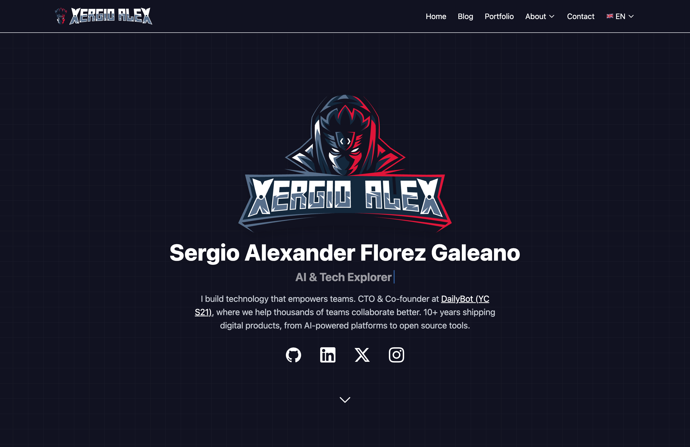

<div align="center">

# XergioAleX.com

**Personal website & blog** · CTO at DailyBot (YC S21) · Builder of 20+ products

[](https://github.com/xergioalex/xergioalex.com/actions/workflows/code_check.yml)
[](LICENSE)
[](https://astro.build)

[🌐 Live Site](https://xergioalex.com) · [📖 Architecture](./docs/ARCHITECTURE.md) · [📋 Product Spec](./docs/PRODUCT_SPEC.md)

</div>

---

## ✨ Overview

A modern, fast, and fully bilingual personal website built with [Astro](https://astro.build). It serves as a professional portfolio, blog platform, and personal brand presence — showcasing experience, projects, and thought leadership.

<p align="center">
  
</p>

### Highlights

| Feature | Description |
| :------ | :---------- |
| 🌐 **Bilingual** | Full English & Spanish with route parity |
| 🌙 **Dark mode** | System-aware theme toggle with persistence |
| ⚡ **Performance-first** | Static site, minimal JS, optimized assets, 99+ PageSpeed |
| 🔍 **SEO-ready** | Sitemap, RSS, Open Graph, semantic HTML |
| 📝 **Content Collections** | Typed blog posts with MDX support |

---

## 🛠 Tech Stack

| Layer | Technology |
| :---- | :--------- |
| Framework | [Astro](https://astro.build) 5.x |
| UI | [Svelte](https://svelte.dev) 5.x |
| Styling | [Tailwind CSS](https://tailwindcss.com) 4.x |
| Content | Markdown, MDX |
| Hosting | [Cloudflare Pages](https://pages.cloudflare.com) |

---

## 🚀 Quick Start

```bash
npm install
npm run dev
```

Visit **http://localhost:4444** to preview.

---

## 📜 Commands

| Command | Description |
| :------ | :---------- |
| `npm run dev` | Start dev server at `localhost:4444` |
| `npm run build` | Production build with type check |
| `npm run astro:preview` | Preview production build locally |
| `npm run biome:check` | Lint and format check |
| `npm run biome:fix` | Auto-fix lint and format issues |
| `npm run astro:check` | TypeScript type checking |
| `npm run test` | Run unit tests |

---

## 📁 Project Structure

```
├── public/           # Static assets (images, fonts, icons)
├── src/
│   ├── components/   # Astro & Svelte components
│   ├── content/      # Blog posts (Content Collections)
│   ├── layouts/     # Page layouts
│   ├── lib/         # Utilities, types, translations
│   ├── pages/       # File-based routing
│   └── styles/      # Global CSS
├── docs/            # Project documentation
├── assets/          # README and documentation assets
└── astro.config.mjs
```

---

## 📚 Documentation

| Document | Description |
| :------- | :---------- |
| [Product Spec](./docs/PRODUCT_SPEC.md) | Vision, features, and content strategy |
| [Architecture](./docs/ARCHITECTURE.md) | Technical implementation and patterns |
| [Development Commands](./docs/DEVELOPMENT_COMMANDS.md) | Build scripts and workflows |
| [Standards](./docs/STANDARDS.md) | Coding conventions |
| [Security](./docs/SECURITY.md) | Security best practices |

---

## 🚢 Deployment

Deployed to **Cloudflare Pages** on every push to `main`:

1. Cloudflare triggers a build
2. Runs `npm run build` (WebP generation + Astro build)
3. Serves the `dist/` folder from its global CDN

Live at **[xergioalex.com](https://xergioalex.com)**.

---

## 📄 License

[MIT](LICENSE) — Sergio Alexander Florez Galeano

### Third-Party Assets

- **Icons:** [Heroicons](https://heroicons.com), [Simple Icons](https://simpleicons.org)

---

<div align="center">
  <sub>Built with Astro · Hosted on Cloudflare Pages</sub>
</div>
